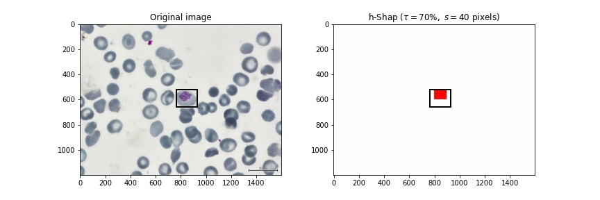

# h-Shap

[](https://codecov.io/gh/Sulam-Group/h-shap)
[](https://circleci.com/gh/Sulam-Group/h-shap)

h-Shap provides a fast, hierarchical implementation of Shapley coefficients for image explanations. It is exact, and it does not rely on approximation. In binary classification scenarios, h-Shap guarantees an exponential computational advantage when explaining an important concept contained in the image (e.g. a sick cell in a blood smear, see example image below).



## Installation

h-Shap is implemented in Python and it can be installed by cloning this repository.

```python
git clone https://github.com/Sulam-Group/h-shap.git
cd h-shap
pip install -e .
```

## Usage

h-Shap currently explains PyTorch models only. Given a model `model`, a reference input `ref`, and an input image `image`, run the following to initialize the explainer and compute the saliency map.

```python
hexp = hshap.src.Explainer(model, ref, s)
explanation, leafs = hexp.explain(image, label=1, threshold_mode=threshold_mode, threshold=threshold)
```

where `s` is a minimal features size (e.g. `40 x 40` pixels), `threshold_mode` can be `"absolute"` or `"relative"`, and `threshold` is a relevance tolerance. See [`demo/`](https://github.com/Sulam-Group/h-shap/tree/master/demo) for further details on the parameters.

## Demo

[`demo/`](https://github.com/Sulam-Group/h-shap/tree/master/demo) contains a simple notebook to showcase h-Shap's functionality on the [BBBC041](https://bbbc.broadinstitute.org/BBBC041) dataset. The dataset comprises blood smears for malaria patients, and the model is trained to label positively all images that contain at least one _trophozoite_, one of the types of cells that indicate malaria. h-Shap then explains the model predictions and retrieves the sick cells in the images.