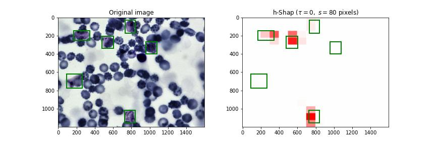

# h-Shap

[](https://codecov.io/gh/Sulam-Group/h-shap)
[](https://circleci.com/gh/Sulam-Group/h-shap)
[](https://zenodo.org/record/5914342)

h-Shap provides a fast, hierarchical implementation of Shapley coefficients for image explanations. It is exact, and it does not rely on approximation. In binary classification scenarios, h-Shap guarantees an exponential computational advantage when explaining an important concept contained in the image (e.g. a sick cell in a blood smear, see example image below).



## Installation

h-Shap can be installed via `pip` from [PyPI](https://pypi.org/project/h-shap/)

```python
python -m pip install h-shap
```

or directly from this repository

```python
git clone https://github.com/Sulam-Group/h-shap.git
cd h-shap
python -m pip install -e .
```

## Usage

h-Shap currently explains PyTorch models only. 

Given a trained model `model` and a reference `ref` to mask features with, initialize an explainer as follows: 

```python
from hshap import Explainer

hexp = hshap.src.Explainer(model=model, background=ref)
```

To explain the prediction of the model on an input image `x`, call the explainer as follows:

```python
explanation = hexp.explain(
  x=x,                            # the input image
  label=l,                    # the label to explain
  s=s,                            # the size of the smallest partition in pixels  
  threshold_mode=threshold_mode,  # either `absolute` or `relative`
  threshold=threshold,            # the threshold to keep exploring partitions
)
```

## Cycle h-Shap

Fixed partitions do not allow to capture features with complex boundaries. _Cycle_ h-Shap is a variation of h-Shap that averages the saliency maps obtained by _cycle-spinnning_ the original partition structure. Let `R` be a sequence of radii, and `A` be a sequence of angles (in radians). cycle h-Shap computes the average saliency maps over all pairs `(r, a)` in `R x A` such that for every pair, the partition structure is _cycle-spun_ by the polar vector `(r, a)`. For example:

```python
s = 64
R = np.linspace(0, s, 4, endpoint=True)
A = np.linspace(0, 2 * np.pi, 8, endpoint=False)

explanation = hexp.cycle_explain(
  x=x,
  label=l,
  s=s,
  R=R,
  A=A,
  threshold_mode=threshold_mode,
  threshold=threshold,
)
```
## Demo on the BBBC041 Dataset

`demo/BBBC041/` contains a simple notebook to showcase h-Shap's functionality on the [BBBC041](https://bbbc.broadinstitute.org/BBBC041) dataset. The dataset comprises blood smears for malaria patients, and the model is trained to label positively all images that contain at least one _trophozoite_, one of the types of cells that indicate malaria. h-Shap then explains the model predictions and retrieves the sick cells in the images.

## Demo on the RSNA 2019 Brain CT Hemorrhage Challenge Dataset

`demo/RSNA_ICH_detection` contains a simple notebook to showcase cycle h-Shap's functionality on the [RSNA 2019 Brain CT Hemorrhage Challenge](https://www.kaggle.com/c/rsna-intracranial-hemorrhage-detection). The dataset comprises head computed tomography scans for healthy patients and patients with intracranial hemorrhage. The model is trained to label positively all images that contain at least one type of hemorrhage. cycle h-Shap then explains the model predictions and retrieves the bleeds in the image.

## Presentations

h-Shap received a Best Paper Award at the ICML 2021 Workshop on Interpretable Machine Learning in Healthcare ([IMLH21](https://sites.google.com/view/imlh2021/home)). You can check out our [oral presentation](https://drive.google.com/file/d/1j0T6uNresC3NAb7HnXv_3UyrLgbKNZd9/view?usp=sharing) here!

## Publications

When using h-Shap, please cite

```text
@article{teneggi2022fast,
  title={Fast hierarchical games for image explanations},
  author={Teneggi, Jacopo and Luster, Alexandre and Sulam, Jeremias},
  journal={IEEE Transactions on Pattern Analysis and Machine Intelligence},
  year={2022},
  publisher={IEEE}
}
```
