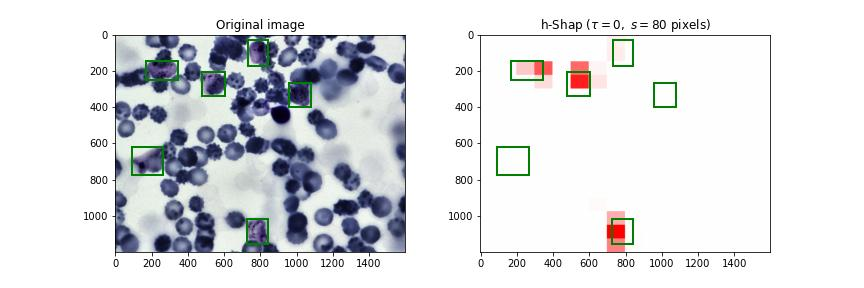

# BBBC041 Demo

In this demo, we showcase h-Shap's performance in a medical imaging setting. The BBBC041 dataset contains 1364 blood smears that contain both healthy and infected cells.

We apply transfer learning on a ResNet18 to predict whether an image contains at least one _trophozoite_, one of the cells that indicate infection by malaria. We achieve a test accuracy of 94% approximately. The weights of the trained network are stored in `model.pth`. h-Shap computes saliency maps based on a fast, exact, hierarchical implementation of Shapley coefficients to identify the features in the images that contribute the most towards the model predictions.

The `/images` folder contains 6 true positive examples from the test dataset, and each image contains exactly one trophozoite, which are annotated in `annotations.json`. Finally, `/explanations` contains the resulting saliency maps, for example:



The notebook `explain.ipynb` contains the code to reproduce these saliency maps.

## Instructions

**Disclaimer: this notebook requires a GPU. We note that the size of the images is significant: `3 x 1200 x 1600` pixels. Executing the code on a GPU will take a few seconds with the default parameters.**

Before running the notebook, make sure that:

- You ran

```python
pip install -r requirements.txt
```

- You have the correct version of CUDA installed. Please refer to [PyTorch Installation Documentation](https://pytorch.org/get-started/locally/). h-Shap does not ship with any version of CUDA.

- Your GPU has at least 6GB of RAM.

To reproduce the saliency map, then, simply execute `explain.ipynb`. We welcome contributions, and we ask to report any issues you may encounter running this demo.

## Default parameters

h-Shap requires the following parameters:

- **Reference input.** As all other state-of-the-art explanation methods based on Shapley coefficients, h-Shap masks features out with an _irrelevant_ input. We call this a reference. Here, we mask features out with their unconditional expectation. This means that the reference input is evaluated once, and then used to explain any new image. `reference.pt` contains the unconditional expectation evaluated on 100 random samples from the training dataset.
- **Minimal feature size (s).** h-Shap builds a hierarchy of games, and then explores it until all relevant leaves have been visited. The minimal feature size specifies how big the leaves should be. Specifically, `s` should be comparable to the concept one is looking for in the images, or slightly smaller. h-Shap breaks when `s` is much smaller than the size of the object to detect.
- **Relevance tolerance (\tau).** Furthermore, h-Shap discards all features that have Shapley coefficients smaller than a relevance tolerance `\tau`. This tolerance can be absolute (e.g. 0), or relative (e.g. 50-th percentile). To specify the relevance tolerance, h-Shap requires 2 parameters: **threshold_mode**, and **threshold**. When `threshold_mode="absolute"`, `threshold` is interpreted as an absolute tolerance, and h-Shap explores the hierarchy of games in a depth-first fashion. When `threshold_mode="relative"`, `threshold` is interpreted as a percentile with respects to all games at the same depth in the hierarchy. Consequently, h-Shap explores the hierarchy in a breadth-first fashion.

Here, the default parameters in the demo are set as follows: `s=40`pixels, `threshold_mode="absolute"`, and `threshold=0`.
